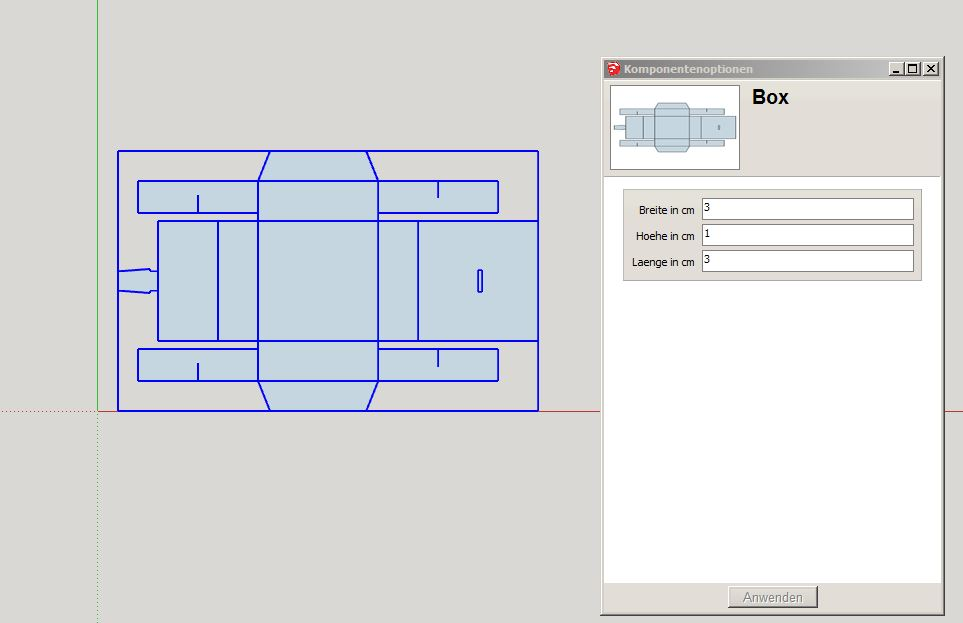
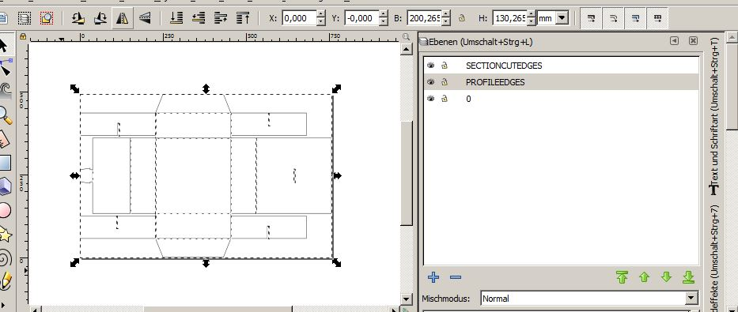
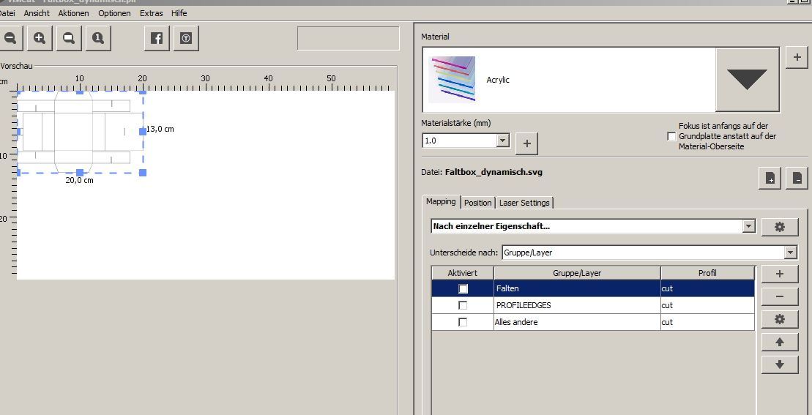

# Faltbox #

Eine skalierbare Box für den Lasercutter oder die Schere. Erstellt mit Sketchup als dynamische Komponente. Projekt von Mini Revollo, umgesetzt im [erfindergarden](http://www.erfindergarden.de).

## Programme ##

- Sketchup
- Inkscape
- Visicut für den Laser

## Werkzeug ##

- Schere
- Cutter
- Lineal
- ... oder ein Lasercutter

## Workflow ##

**SKETCHUP**

 
- Die .skp-Datei mit Sketchup öffnen
- Menue-Ansichten-Symbolleiste-Dynamische Komponenten auswählen
- Die Box mit dem Zeigeinstrument markieren
- Im Fenster Dynamische Komponenten- Komponentenoptionen wählen
- gewünschte Größe eingeben
- Die angepasste Box kopieren (Strg-C) und daneben wieder einfügen (Strg-P).
- Die kopierte Box mit dem Zeigeinstrument markieren
- rechte Maustaste drücken, in Einzelteile auflösen drücken.
- nochmal rechte Maustaste drücken, in Einzelteile auflösen drücken.
- Datei - Exportieren - 2D-Grafik - DXF
- Exportoptionen: Porfillinien "Separat auf einem Layer" aktivieren

**INKSCAPE**

 
- DXF Datei öffnen
- Layer-Ansicht öffnen
- Die mit Sketchup nicht in Einzelteile zerleget Box löschen
- Es gibt 3 Layer, Profiledges,0 und Sectioncutedges
- Profiledges sind die Aussenlinien, die zum Schneiden benötigt werden.
- 0 beinhaltet die inneren Linien
- Sectioncutedges ist leer
- Layer 0 ausblenden
- Mit dem Zeigewerkzeug alles markieren
- Pfad - kombinieren
- Knotenwerkzeug wählen und mit Strg alles markieren
- gewählte Knoten vereinigen Button drücken, dauert kurz
- Layer Profiledges aus und Layer 0 einblenden
- mit wem Zeigewerkzeug + Umschlaten die gewünschten Schnitte aus dem inneren noch markieren
- Ebene - Auswahl zu anderer Ebene verschieben - Profiledges wählen
- Layer 0 umbenennen in Falten
- Layer Gravur anlegen und nach belieben bestücken
- alles mit Zeigewerkzeug markieren - Bearbeiten - Seitengröße auf Auswahlgröße ändern
- Datei als SVG Speichern

**VISICUT**

 
- SVG_Datei öffnen
- Mapping nach Layer wählen
- Falten Layer markieren und auf cut stellen
- Laser-Settings für Falten auf Power 5 und Speed 100 stellen
- Ausführen drücken und Job an den Laser senden
- Laser-Settings für Schneiden auf Power 20 und Speed 100 stellen
- Profiledges Layer markieren und auf cut stellen
- Ausführen drücken und Job an den Laser senden
- Gravur Layer markieren und auf engrave stellen
- Laser-Settings für Gravur auf Power 30 und Speed 100 stellen
- Ausführen drücken und Job an den Laser senden
- zuerst falten und gravieren, danach erst schneiden

